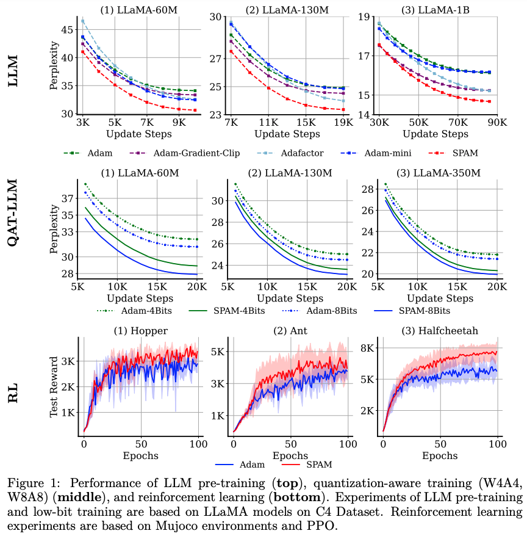

# SPAM
This repo contains the pre-release version of SPAM optimizer, proposed by [SPAM: Spike-Aware Adam with Momentum Reset for Stable LLM Training](https://arxiv.org/pdf/2501.06842).


We introduce  SPAM, a novel optimizer with momentum reset and spike-aware clipping that outperforms existing methods like Adam and Adafactor on various tasks, including LLM training, Quantization-Aware LLM training, Reinforcement Learning, and Time Series Forecasting.

<div align="center">
  
</div>

## Abstract

Large Language Models (LLMs) have demonstrated exceptional performance across diverse tasks, yet their training remains highly resourceintensive and susceptible to critical challenges such as training instability. A predominant source of this instability stems from gradient and loss spikes, which disrupt the learning process, often leading to costly interventions like checkpoint recovery and experiment restarts, further amplifying inefficiencies.This paper presents a comprehensive investigation into gradient spikes observed during LLM training, revealing their prevalence across multiple architectures and datasets. Our analysis shows that these spikes can be up to 1000× larger than typical gradients, substantially deteriorating model performance. To address this issue, we propose Spike-Aware Adam with Momentum Reset (SPAM), a novel optimizer designed to counteract gradient spikes through momentum reset and spike-aware gradient clipping. Extensive experiments, including both pre-training and fine-tuning, demonstrate that SPAM consistently surpasses Adam and its variants across various tasks, including (1) LLM pre-training from 60M to 1B, (2) 4-bit LLM pre-training,(3) reinforcement learning, and (4) Time Series Forecasting. Additionally, SPAM facilitates memory-efficient training by enabling sparse momentum, where only a subset of momentum terms are maintained and updated. When operating under memory constraints, SPAM outperforms state-of-the-art memory-efficient optimizers such as GaLore and AdamMini. Our work underscores the importance of mitigating gradient spikes in LLM training and introduces an effective optimization strategy that enhances both training stability and resource efficiency at scale.

### TODO

- [x] Release LLM pre-training codes.
- [ ] Release QAT (A4W4 and A8W8) LLM training codes.
- [ ] Release Reinforcement Learning training codes.
- [ ] Release Time Series Forescasting training codes.

## Quick Start

### Setup
Our repository is built on top of [GaLore](https://github.com/jiaweizzhao/GaLore). You can configure the environment using the following command lines:
conda create -n spam python=3.11 -y <br>
conda activate spam<br>
pip3 install torch torchvision torchaudio<br>
pip install transformers==4.31.0<br>
pip install tqdm wandb<br>
## Usage

```python
from galore_torch import SPAM
# define param groups as spam_params and non_spam_params
param_groups = [{'params': non_spam_params}, 
                {'params': spam_params, 'density': 1.0}]
optimizer = SPAM(param_groups, lr=0.001,warmup_steps=150,threshold=5000,DeltaT=500)
```

### example: Training LLaMA-130M 
```
torchrun --standalone --nproc_per_node 2 torchrun_main.py \
    --model_config configs/llama_130m.json \
    --lr 8e-4 \
    --density 1.0 \
    --DeltaT 500 \
    --batch_size 128  \
    --total_batch_size 512 \
    --num_training_steps 20000 \
    --warmup_steps 1000 \
    --weight_decay 0 \
    --dtype bfloat16 \
    --eval_every 1000 \
    --threshold 5000 \
    --save_dir $save_dir \
    --optimizer SPAM \
    --warmup_epoch 150 
```

### example: Training LLaMA-350M 
```
torchrun --standalone --nproc_per_node 2 torchrun_main.py \
    --model_config configs/llama_350m.json \
    --lr 4e-4 \
    --density 1.0 \
    --DeltaT 500 \
    --batch_size 128  \
    --total_batch_size 512 \
    --num_training_steps 60000 \
    --warmup_steps 1000 \
    --weight_decay 0 \
    --dtype bfloat16 \
    --eval_every 1000 \
    --threshold 5000 \
    --save_dir $save_dir \
    --optimizer SPAM \
    --warmup_epoch 150 
```
## Acknowledgement
This repository is build upon the  [GaLore](https://github.com/jiaweizzhao/GaLore) repository. Thanks for the great work!